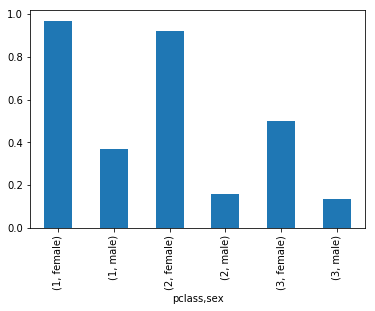

```python
# sklearn 0.19
import matplotlib.pyplot as plt
%matplotlib inline
import random
import numpy as np
import pandas as pd
from sklearn import datasets, svm, tree, preprocessing, metrics
# because cv is depressed since 1.8, do below
from sklearn.model_selection import train_test_split, ShuffleSplit, cross_val_score

import sklearn.ensemble as ske
import tensorflow as tf
#from tensorflow.contrib.learn import skflow
import tensorflow.contrib.learn as skflow
```

# Load, play and preprocess the dataset


```python
raw_df = pd.read_csv('./train.csv')
raw_df.columns = map(str.lower, raw_df.columns)
titanic_df = raw_df[['survived', 'pclass', 'sex', 'age', 'sibsp', 'parch', 'fare', 'embarked']].copy()
titanic_df.head()
```


<div>
<table border="1" class="dataframe">
  <thead>
    <tr style="text-align: right;">
      <th></th>
      <th>survived</th>
      <th>pclass</th>
      <th>sex</th>
      <th>age</th>
      <th>sibsp</th>
      <th>parch</th>
      <th>fare</th>
      <th>embarked</th>
    </tr>
  </thead>
  <tbody>
    <tr>
      <th>0</th>
      <td>0</td>
      <td>3</td>
      <td>male</td>
      <td>22.0</td>
      <td>1</td>
      <td>0</td>
      <td>7.2500</td>
      <td>S</td>
    </tr>
    <tr>
      <th>1</th>
      <td>1</td>
      <td>1</td>
      <td>female</td>
      <td>38.0</td>
      <td>1</td>
      <td>0</td>
      <td>71.2833</td>
      <td>C</td>
    </tr>
    <tr>
      <th>2</th>
      <td>1</td>
      <td>3</td>
      <td>female</td>
      <td>26.0</td>
      <td>0</td>
      <td>0</td>
      <td>7.9250</td>
      <td>S</td>
    </tr>
    <tr>
      <th>3</th>
      <td>1</td>
      <td>1</td>
      <td>female</td>
      <td>35.0</td>
      <td>1</td>
      <td>0</td>
      <td>53.1000</td>
      <td>S</td>
    </tr>
    <tr>
      <th>4</th>
      <td>0</td>
      <td>3</td>
      <td>male</td>
      <td>35.0</td>
      <td>0</td>
      <td>0</td>
      <td>8.0500</td>
      <td>S</td>
    </tr>
  </tbody>
</table>
</div>


```python
class_sex_grouping = titanic_df.groupby(['pclass','sex']).mean()
class_sex_grouping
```


<div>
<table border="1" class="dataframe">
  <thead>
    <tr style="text-align: right;">
      <th></th>
      <th></th>
      <th>survived</th>
      <th>age</th>
      <th>sibsp</th>
      <th>parch</th>
      <th>fare</th>
    </tr>
    <tr>
      <th>pclass</th>
      <th>sex</th>
      <th></th>
      <th></th>
      <th></th>
      <th></th>
      <th></th>
    </tr>
  </thead>
  <tbody>
    <tr>
      <th rowspan="2" valign="top">1</th>
      <th>female</th>
      <td>0.968085</td>
      <td>34.611765</td>
      <td>0.553191</td>
      <td>0.457447</td>
      <td>106.125798</td>
    </tr>
    <tr>
      <th>male</th>
      <td>0.368852</td>
      <td>41.281386</td>
      <td>0.311475</td>
      <td>0.278689</td>
      <td>67.226127</td>
    </tr>
    <tr>
      <th rowspan="2" valign="top">2</th>
      <th>female</th>
      <td>0.921053</td>
      <td>28.722973</td>
      <td>0.486842</td>
      <td>0.605263</td>
      <td>21.970121</td>
    </tr>
    <tr>
      <th>male</th>
      <td>0.157407</td>
      <td>30.740707</td>
      <td>0.342593</td>
      <td>0.222222</td>
      <td>19.741782</td>
    </tr>
    <tr>
      <th rowspan="2" valign="top">3</th>
      <th>female</th>
      <td>0.500000</td>
      <td>21.750000</td>
      <td>0.895833</td>
      <td>0.798611</td>
      <td>16.118810</td>
    </tr>
    <tr>
      <th>male</th>
      <td>0.135447</td>
      <td>26.507589</td>
      <td>0.498559</td>
      <td>0.224784</td>
      <td>12.661633</td>
    </tr>
  </tbody>
</table>
</div>


```python
class_sex_grouping['survived'].plot.bar()
```


    <matplotlib.axes._subplots.AxesSubplot at 0x1fe6e638a20>





```python
# titanic_df['sex'].unique()
# sexes = sorted(titatitanic_df['sex'].unique()
# sexes = sorted(titanic_df['sex'].unique())
# genders_mapping = dict(zip(sexes, range(0, len(sexes) + 1)))
# titanic_df['sex_mod'] = titanic_df['sex'].map(genders_mapping).astype(int)

# titanic_df['embarked'].fillna('-', inplace=True)
# embarked_locs = sorted(titanic_df['embarked'].unique())
# embarked_locs_mapping = dict(zip(embarked_locs, range(0, len(embarked_locs) + 1)))
# embarked_locs_mapping
# titanic_df['embarked_Mod'] = titanic_df['embarked'].map(embarked_locs_mapping).astype(int)

# titanic_df['age_mod'] = titanic_df['age']
# titanic_df['age_mod'] = titanic_df['age_mod'].groupby([titanic_df['sex_mod'], titanic_df['pclass']]).apply(lambda x: x.fillna(x.median()))

# titanic_df = titanic_df.drop(['age','sex','embarked'], axis=1)

# titanic_df.count()nic_df['sex'].unique())
# genders_mapping = dict(zip(sexes, range(0, len(sexes) + 1)))
# titanic_df['sex_mod'] = titanic_df['sex'].map(genders_mapping).astype(int)

# titanic_df['embarked'].fillna('-', inplace=True)
# embarked_locs = sorted(titanic_df['embarked'].unique())
# embarked_locs_mapping = dict(zip(embarked_locs, range(0, len(embarked_locs) + 1)))
# embarked_locs_mapping
# titanic_df['embarked_Mod'] = titanic_df['embarked'].map(embarked_locs_mapping).astype(int)

# titanic_df['age_mod'] = titanic_df['age']
# titanic_df['age_mod'] = titanic_df['age_mod'].groupby([titanic_df['sex_mod'], titanic_df['pclass']]).apply(lambda x: x.fillna(x.median()))

# titanic_df = titanic_df.drop(['age','sex','embarked'], axis=1)

# titanic_df.count()
```


```python
def preprocess_titanic_df(df):
    processed_df = df.copy()
    le = preprocessing.LabelEncoder()
    processed_df.sex = le.fit_transform(processed_df.sex)
    processed_df.embarked = processed_df.embarked.fillna('-')
    # inplace..
    processed_df.embarked = le.fit_transform(processed_df.embarked)
    processed_df['age'] = titanic_df['age'].groupby([titanic_df['sex'], titanic_df['pclass']]).apply(lambda x: x.fillna(x.median()))

    processed_df = processed_df.drop(['name','ticket', "cabin"],axis=1)
    return processed_df
```


```python
processed_df = preprocess_titanic_df(raw_df)
processed_df
```


<div>
<table border="1" class="dataframe">
  <thead>
    <tr style="text-align: right;">
      <th></th>
      <th>passengerid</th>
      <th>survived</th>
      <th>pclass</th>
      <th>sex</th>
      <th>age</th>
      <th>sibsp</th>
      <th>parch</th>
      <th>fare</th>
      <th>embarked</th>
    </tr>
  </thead>
  <tbody>
    <tr>
      <th>0</th>
      <td>1</td>
      <td>0</td>
      <td>3</td>
      <td>1</td>
      <td>22.0</td>
      <td>1</td>
      <td>0</td>
      <td>7.2500</td>
      <td>3</td>
    </tr>
    <tr>
      <th>1</th>
      <td>2</td>
      <td>1</td>
      <td>1</td>
      <td>0</td>
      <td>38.0</td>
      <td>1</td>
      <td>0</td>
      <td>71.2833</td>
      <td>1</td>
    </tr>
    <tr>
      <th>2</th>
      <td>3</td>
      <td>1</td>
      <td>3</td>
      <td>0</td>
      <td>26.0</td>
      <td>0</td>
      <td>0</td>
      <td>7.9250</td>
      <td>3</td>
    </tr>
    <tr>
      <th>3</th>
      <td>4</td>
      <td>1</td>
      <td>1</td>
      <td>0</td>
      <td>35.0</td>
      <td>1</td>
      <td>0</td>
      <td>53.1000</td>
      <td>3</td>
    </tr>
    <tr>
      <th>4</th>
      <td>5</td>
      <td>0</td>
      <td>3</td>
      <td>1</td>
      <td>35.0</td>
      <td>0</td>
      <td>0</td>
      <td>8.0500</td>
      <td>3</td>
    </tr>
    <tr>
      <th>5</th>
      <td>6</td>
      <td>0</td>
      <td>3</td>
      <td>1</td>
      <td>25.0</td>
      <td>0</td>
      <td>0</td>
      <td>8.4583</td>
      <td>2</td>
    </tr>
    <tr>
      <th>6</th>
      <td>7</td>
      <td>0</td>
      <td>1</td>
      <td>1</td>
      <td>54.0</td>
      <td>0</td>
      <td>0</td>
      <td>51.8625</td>
      <td>3</td>
    </tr>
    <tr>
      <th>7</th>
      <td>8</td>
      <td>0</td>
      <td>3</td>
      <td>1</td>
      <td>2.0</td>
      <td>3</td>
      <td>1</td>
      <td>21.0750</td>
      <td>3</td>
    </tr>
    <tr>
      <th>8</th>
      <td>9</td>
      <td>1</td>
      <td>3</td>
      <td>0</td>
      <td>27.0</td>
      <td>0</td>
      <td>2</td>
      <td>11.1333</td>
      <td>3</td>
    </tr>
    <tr>
      <th>9</th>
      <td>10</td>
      <td>1</td>
      <td>2</td>
      <td>0</td>
      <td>14.0</td>
      <td>1</td>
      <td>0</td>
      <td>30.0708</td>
      <td>1</td>
    </tr>
    <tr>
      <th>10</th>
      <td>11</td>
      <td>1</td>
      <td>3</td>
      <td>0</td>
      <td>4.0</td>
      <td>1</td>
      <td>1</td>
      <td>16.7000</td>
      <td>3</td>
    </tr>
    <tr>
      <th>11</th>
      <td>12</td>
      <td>1</td>
      <td>1</td>
      <td>0</td>
      <td>58.0</td>
      <td>0</td>
      <td>0</td>
      <td>26.5500</td>
      <td>3</td>
    </tr>
    <tr>
      <th>12</th>
      <td>13</td>
      <td>0</td>
      <td>3</td>
      <td>1</td>
      <td>20.0</td>
      <td>0</td>
      <td>0</td>
      <td>8.0500</td>
      <td>3</td>
    </tr>
    <tr>
      <th>13</th>
      <td>14</td>
      <td>0</td>
      <td>3</td>
      <td>1</td>
      <td>39.0</td>
      <td>1</td>
      <td>5</td>
      <td>31.2750</td>
      <td>3</td>
    </tr>
    <tr>
      <th>14</th>
      <td>15</td>
      <td>0</td>
      <td>3</td>
      <td>0</td>
      <td>14.0</td>
      <td>0</td>
      <td>0</td>
      <td>7.8542</td>
      <td>3</td>
    </tr>
    <tr>
      <th>15</th>
      <td>16</td>
      <td>1</td>
      <td>2</td>
      <td>0</td>
      <td>55.0</td>
      <td>0</td>
      <td>0</td>
      <td>16.0000</td>
      <td>3</td>
    </tr>
    <tr>
      <th>16</th>
      <td>17</td>
      <td>0</td>
      <td>3</td>
      <td>1</td>
      <td>2.0</td>
      <td>4</td>
      <td>1</td>
      <td>29.1250</td>
      <td>2</td>
    </tr>
    <tr>
      <th>17</th>
      <td>18</td>
      <td>1</td>
      <td>2</td>
      <td>1</td>
      <td>30.0</td>
      <td>0</td>
      <td>0</td>
      <td>13.0000</td>
      <td>3</td>
    </tr>
    <tr>
      <th>18</th>
      <td>19</td>
      <td>0</td>
      <td>3</td>
      <td>0</td>
      <td>31.0</td>
      <td>1</td>
      <td>0</td>
      <td>18.0000</td>
      <td>3</td>
    </tr>
    <tr>
      <th>19</th>
      <td>20</td>
      <td>1</td>
      <td>3</td>
      <td>0</td>
      <td>21.5</td>
      <td>0</td>
      <td>0</td>
      <td>7.2250</td>
      <td>1</td>
    </tr>
    <tr>
      <th>20</th>
      <td>21</td>
      <td>0</td>
      <td>2</td>
      <td>1</td>
      <td>35.0</td>
      <td>0</td>
      <td>0</td>
      <td>26.0000</td>
      <td>3</td>
    </tr>
    <tr>
      <th>21</th>
      <td>22</td>
      <td>1</td>
      <td>2</td>
      <td>1</td>
      <td>34.0</td>
      <td>0</td>
      <td>0</td>
      <td>13.0000</td>
      <td>3</td>
    </tr>
    <tr>
      <th>22</th>
      <td>23</td>
      <td>1</td>
      <td>3</td>
      <td>0</td>
      <td>15.0</td>
      <td>0</td>
      <td>0</td>
      <td>8.0292</td>
      <td>2</td>
    </tr>
    <tr>
      <th>23</th>
      <td>24</td>
      <td>1</td>
      <td>1</td>
      <td>1</td>
      <td>28.0</td>
      <td>0</td>
      <td>0</td>
      <td>35.5000</td>
      <td>3</td>
    </tr>
    <tr>
      <th>24</th>
      <td>25</td>
      <td>0</td>
      <td>3</td>
      <td>0</td>
      <td>8.0</td>
      <td>3</td>
      <td>1</td>
      <td>21.0750</td>
      <td>3</td>
    </tr>
    <tr>
      <th>25</th>
      <td>26</td>
      <td>1</td>
      <td>3</td>
      <td>0</td>
      <td>38.0</td>
      <td>1</td>
      <td>5</td>
      <td>31.3875</td>
      <td>3</td>
    </tr>
    <tr>
      <th>26</th>
      <td>27</td>
      <td>0</td>
      <td>3</td>
      <td>1</td>
      <td>25.0</td>
      <td>0</td>
      <td>0</td>
      <td>7.2250</td>
      <td>1</td>
    </tr>
    <tr>
      <th>27</th>
      <td>28</td>
      <td>0</td>
      <td>1</td>
      <td>1</td>
      <td>19.0</td>
      <td>3</td>
      <td>2</td>
      <td>263.0000</td>
      <td>3</td>
    </tr>
    <tr>
      <th>28</th>
      <td>29</td>
      <td>1</td>
      <td>3</td>
      <td>0</td>
      <td>21.5</td>
      <td>0</td>
      <td>0</td>
      <td>7.8792</td>
      <td>2</td>
    </tr>
    <tr>
      <th>29</th>
      <td>30</td>
      <td>0</td>
      <td>3</td>
      <td>1</td>
      <td>25.0</td>
      <td>0</td>
      <td>0</td>
      <td>7.8958</td>
      <td>3</td>
    </tr>
    <tr>
      <th>...</th>
      <td>...</td>
      <td>...</td>
      <td>...</td>
      <td>...</td>
      <td>...</td>
      <td>...</td>
      <td>...</td>
      <td>...</td>
      <td>...</td>
    </tr>
    <tr>
      <th>861</th>
      <td>862</td>
      <td>0</td>
      <td>2</td>
      <td>1</td>
      <td>21.0</td>
      <td>1</td>
      <td>0</td>
      <td>11.5000</td>
      <td>3</td>
    </tr>
    <tr>
      <th>862</th>
      <td>863</td>
      <td>1</td>
      <td>1</td>
      <td>0</td>
      <td>48.0</td>
      <td>0</td>
      <td>0</td>
      <td>25.9292</td>
      <td>3</td>
    </tr>
    <tr>
      <th>863</th>
      <td>864</td>
      <td>0</td>
      <td>3</td>
      <td>0</td>
      <td>21.5</td>
      <td>8</td>
      <td>2</td>
      <td>69.5500</td>
      <td>3</td>
    </tr>
    <tr>
      <th>864</th>
      <td>865</td>
      <td>0</td>
      <td>2</td>
      <td>1</td>
      <td>24.0</td>
      <td>0</td>
      <td>0</td>
      <td>13.0000</td>
      <td>3</td>
    </tr>
    <tr>
      <th>865</th>
      <td>866</td>
      <td>1</td>
      <td>2</td>
      <td>0</td>
      <td>42.0</td>
      <td>0</td>
      <td>0</td>
      <td>13.0000</td>
      <td>3</td>
    </tr>
    <tr>
      <th>866</th>
      <td>867</td>
      <td>1</td>
      <td>2</td>
      <td>0</td>
      <td>27.0</td>
      <td>1</td>
      <td>0</td>
      <td>13.8583</td>
      <td>1</td>
    </tr>
    <tr>
      <th>867</th>
      <td>868</td>
      <td>0</td>
      <td>1</td>
      <td>1</td>
      <td>31.0</td>
      <td>0</td>
      <td>0</td>
      <td>50.4958</td>
      <td>3</td>
    </tr>
    <tr>
      <th>868</th>
      <td>869</td>
      <td>0</td>
      <td>3</td>
      <td>1</td>
      <td>25.0</td>
      <td>0</td>
      <td>0</td>
      <td>9.5000</td>
      <td>3</td>
    </tr>
    <tr>
      <th>869</th>
      <td>870</td>
      <td>1</td>
      <td>3</td>
      <td>1</td>
      <td>4.0</td>
      <td>1</td>
      <td>1</td>
      <td>11.1333</td>
      <td>3</td>
    </tr>
    <tr>
      <th>870</th>
      <td>871</td>
      <td>0</td>
      <td>3</td>
      <td>1</td>
      <td>26.0</td>
      <td>0</td>
      <td>0</td>
      <td>7.8958</td>
      <td>3</td>
    </tr>
    <tr>
      <th>871</th>
      <td>872</td>
      <td>1</td>
      <td>1</td>
      <td>0</td>
      <td>47.0</td>
      <td>1</td>
      <td>1</td>
      <td>52.5542</td>
      <td>3</td>
    </tr>
    <tr>
      <th>872</th>
      <td>873</td>
      <td>0</td>
      <td>1</td>
      <td>1</td>
      <td>33.0</td>
      <td>0</td>
      <td>0</td>
      <td>5.0000</td>
      <td>3</td>
    </tr>
    <tr>
      <th>873</th>
      <td>874</td>
      <td>0</td>
      <td>3</td>
      <td>1</td>
      <td>47.0</td>
      <td>0</td>
      <td>0</td>
      <td>9.0000</td>
      <td>3</td>
    </tr>
    <tr>
      <th>874</th>
      <td>875</td>
      <td>1</td>
      <td>2</td>
      <td>0</td>
      <td>28.0</td>
      <td>1</td>
      <td>0</td>
      <td>24.0000</td>
      <td>1</td>
    </tr>
    <tr>
      <th>875</th>
      <td>876</td>
      <td>1</td>
      <td>3</td>
      <td>0</td>
      <td>15.0</td>
      <td>0</td>
      <td>0</td>
      <td>7.2250</td>
      <td>1</td>
    </tr>
    <tr>
      <th>876</th>
      <td>877</td>
      <td>0</td>
      <td>3</td>
      <td>1</td>
      <td>20.0</td>
      <td>0</td>
      <td>0</td>
      <td>9.8458</td>
      <td>3</td>
    </tr>
    <tr>
      <th>877</th>
      <td>878</td>
      <td>0</td>
      <td>3</td>
      <td>1</td>
      <td>19.0</td>
      <td>0</td>
      <td>0</td>
      <td>7.8958</td>
      <td>3</td>
    </tr>
    <tr>
      <th>878</th>
      <td>879</td>
      <td>0</td>
      <td>3</td>
      <td>1</td>
      <td>25.0</td>
      <td>0</td>
      <td>0</td>
      <td>7.8958</td>
      <td>3</td>
    </tr>
    <tr>
      <th>879</th>
      <td>880</td>
      <td>1</td>
      <td>1</td>
      <td>0</td>
      <td>56.0</td>
      <td>0</td>
      <td>1</td>
      <td>83.1583</td>
      <td>1</td>
    </tr>
    <tr>
      <th>880</th>
      <td>881</td>
      <td>1</td>
      <td>2</td>
      <td>0</td>
      <td>25.0</td>
      <td>0</td>
      <td>1</td>
      <td>26.0000</td>
      <td>3</td>
    </tr>
    <tr>
      <th>881</th>
      <td>882</td>
      <td>0</td>
      <td>3</td>
      <td>1</td>
      <td>33.0</td>
      <td>0</td>
      <td>0</td>
      <td>7.8958</td>
      <td>3</td>
    </tr>
    <tr>
      <th>882</th>
      <td>883</td>
      <td>0</td>
      <td>3</td>
      <td>0</td>
      <td>22.0</td>
      <td>0</td>
      <td>0</td>
      <td>10.5167</td>
      <td>3</td>
    </tr>
    <tr>
      <th>883</th>
      <td>884</td>
      <td>0</td>
      <td>2</td>
      <td>1</td>
      <td>28.0</td>
      <td>0</td>
      <td>0</td>
      <td>10.5000</td>
      <td>3</td>
    </tr>
    <tr>
      <th>884</th>
      <td>885</td>
      <td>0</td>
      <td>3</td>
      <td>1</td>
      <td>25.0</td>
      <td>0</td>
      <td>0</td>
      <td>7.0500</td>
      <td>3</td>
    </tr>
    <tr>
      <th>885</th>
      <td>886</td>
      <td>0</td>
      <td>3</td>
      <td>0</td>
      <td>39.0</td>
      <td>0</td>
      <td>5</td>
      <td>29.1250</td>
      <td>2</td>
    </tr>
    <tr>
      <th>886</th>
      <td>887</td>
      <td>0</td>
      <td>2</td>
      <td>1</td>
      <td>27.0</td>
      <td>0</td>
      <td>0</td>
      <td>13.0000</td>
      <td>3</td>
    </tr>
    <tr>
      <th>887</th>
      <td>888</td>
      <td>1</td>
      <td>1</td>
      <td>0</td>
      <td>19.0</td>
      <td>0</td>
      <td>0</td>
      <td>30.0000</td>
      <td>3</td>
    </tr>
    <tr>
      <th>888</th>
      <td>889</td>
      <td>0</td>
      <td>3</td>
      <td>0</td>
      <td>21.5</td>
      <td>1</td>
      <td>2</td>
      <td>23.4500</td>
      <td>3</td>
    </tr>
    <tr>
      <th>889</th>
      <td>890</td>
      <td>1</td>
      <td>1</td>
      <td>1</td>
      <td>26.0</td>
      <td>0</td>
      <td>0</td>
      <td>30.0000</td>
      <td>1</td>
    </tr>
    <tr>
      <th>890</th>
      <td>891</td>
      <td>0</td>
      <td>3</td>
      <td>1</td>
      <td>32.0</td>
      <td>0</td>
      <td>0</td>
      <td>7.7500</td>
      <td>2</td>
    </tr>
  </tbody>
</table>
<p>891 rows × 9 columns</p>
</div>


# Split the data


```python
X = processed_df.drop(['survived'], axis=1).values
y = processed_df['survived'].values
```


```python
X_train, X_test, y_train, y_test = train_test_split(X,y,test_size=0.2)
```

# Decision Tree


```python
clf_dt = tree.DecisionTreeClassifier(max_depth=10)
clf_dt.fit (X_train, y_train)
clf_dt.score (X_test, y_test)
```


    0.7988826815642458


#


```python
shuffle_validator = ShuffleSplit(n_splits=20, test_size=0.2, random_state=0)
def test_classifier(clf):
    scores = cross_val_score(clf, X, y, cv=shuffle_validator)
    print("Accuracy: %0.4f (+/- %0.2f)" % (scores.mean(), scores.std()))
```


```python
test_classifier(clf_dt)
```

    Accuracy: 0.7922 (+/- 0.03)
    

# Other simple Classification

The **“Random Forest”** classification algorithm will create a multitude of (generally very poor) trees for the data set using different random subsets of the input variables, and will return whichever prediction was returned by the most trees. This helps to avoid “overfitting”, a problem that occurs when a model is so tightly fitted to arbitrary correlations in the training data that it performs poorly on test data.

The **“Gradient Boosting”** classifier will generate many weak, shallow prediction trees and will combine, or “boost”, them into a strong model. This model performs very well on our data set, but has the drawback of being relatively slow and difficult to optimize, as the model construction happens sequentially so it cannot be parallelized.

A **“Voting”** classifier can be used to apply multiple conceptually divergent classification models to the same data set and will return the majority vote from all of the classifiers. For instance, if the gradient boosting classifier predicts that a passenger will not survive, but the decision tree and random forest classifiers predict that they will live, the voting classifier will chose the latter.


```python
clf_rf = ske.RandomForestClassifier(n_estimators=50)
test_classifier(clf_rf)
```

    Accuracy: 0.8274 (+/- 0.03)
    


```python
clf_gb = ske.GradientBoostingClassifier(n_estimators=50)
test_classifier(clf_gb)
```

    Accuracy: 0.8318 (+/- 0.03)
    


```python
eclf = ske.VotingClassifier([('dt', clf_dt), ('rf', clf_rf), ('gb', clf_gb)])
test_classifier(eclf)
```

    Accuracy: 0.8332 (+/- 0.03)
    

# Deep Neural Networks - Tensorflow


```python
feature_columns = [tf.contrib.layers.real_valued_column("", dimension=4)]

tf_clf_dnn = skflow.DNNClassifier(
    feature_columns=feature_columns,
    hidden_units=[20, 40, 20], 
    n_classes=2, 
    model_dir="./titanic_DNN_model")
tf_clf_dnn.fit(
    x=X_train, 
    y=y_train,
    steps=200)
tf_clf_dnn.evaluate(X_test, y_test)
```

    INFO:tensorflow:Using default config.
    INFO:tensorflow:Using config: {'_cluster_spec': <tensorflow.python.training.server_lib.ClusterSpec object at 0x000001FE6EABDC88>, '_save_checkpoints_secs': 600, '_num_ps_replicas': 0, '_save_checkpoints_steps': None, '_environment': 'local', '_tf_config': gpu_options {
      per_process_gpu_memory_fraction: 1
    }
    , '_master': '', '_keep_checkpoint_every_n_hours': 10000, '_is_chief': True, '_task_id': 0, '_save_summary_steps': 100, '_keep_checkpoint_max': 5, '_task_type': None, '_tf_random_seed': None, '_evaluation_master': ''}
    WARNING:tensorflow:From <ipython-input-16-4828b6551cd4>:11: calling BaseEstimator.fit (from tensorflow.contrib.learn.python.learn.estimators.estimator) with y is deprecated and will be removed after 2016-12-01.
    Instructions for updating:
    Estimator is decoupled from Scikit Learn interface by moving into
    separate class SKCompat. Arguments x, y and batch_size are only
    available in the SKCompat class, Estimator will only accept input_fn.
    Example conversion:
      est = Estimator(...) -> est = SKCompat(Estimator(...))
    WARNING:tensorflow:From <ipython-input-16-4828b6551cd4>:11: calling BaseEstimator.fit (from tensorflow.contrib.learn.python.learn.estimators.estimator) with x is deprecated and will be removed after 2016-12-01.
    Instructions for updating:
    Estimator is decoupled from Scikit Learn interface by moving into
    separate class SKCompat. Arguments x, y and batch_size are only
    available in the SKCompat class, Estimator will only accept input_fn.
    Example conversion:
      est = Estimator(...) -> est = SKCompat(Estimator(...))
    WARNING:tensorflow:float64 is not supported by many models, consider casting to float32.
    

    C:\Users\user\Anaconda3\envs\py35\lib\site-packages\tensorflow\python\util\deprecation.py:247: FutureWarning: comparison to `None` will result in an elementwise object comparison in the future.
      equality = a == b
    

    WARNING:tensorflow:From C:\Users\user\Anaconda3\envs\py35\lib\site-packages\tensorflow\contrib\learn\python\learn\estimators\head.py:1362: scalar_summary (from tensorflow.python.ops.logging_ops) is deprecated and will be removed after 2016-11-30.
    Instructions for updating:
    Please switch to tf.summary.scalar. Note that tf.summary.scalar uses the node name instead of the tag. This means that TensorFlow will automatically de-duplicate summary names based on the scope they are created in. Also, passing a tensor or list of tags to a scalar summary op is no longer supported.
    INFO:tensorflow:Create CheckpointSaverHook.
    INFO:tensorflow:Saving checkpoints for 201 into ./titanic_DNN_model\model.ckpt.
    INFO:tensorflow:loss = 0.626438, step = 201
    INFO:tensorflow:global_step/sec: 303.603
    INFO:tensorflow:loss = 0.617631, step = 301
    INFO:tensorflow:Saving checkpoints for 400 into ./titanic_DNN_model\model.ckpt.
    INFO:tensorflow:Loss for final step: 0.608085.
    WARNING:tensorflow:From <ipython-input-16-4828b6551cd4>:12: calling BaseEstimator.evaluate (from tensorflow.contrib.learn.python.learn.estimators.estimator) with y is deprecated and will be removed after 2016-12-01.
    Instructions for updating:
    Estimator is decoupled from Scikit Learn interface by moving into
    separate class SKCompat. Arguments x, y and batch_size are only
    available in the SKCompat class, Estimator will only accept input_fn.
    Example conversion:
      est = Estimator(...) -> est = SKCompat(Estimator(...))
    WARNING:tensorflow:From <ipython-input-16-4828b6551cd4>:12: calling BaseEstimator.evaluate (from tensorflow.contrib.learn.python.learn.estimators.estimator) with x is deprecated and will be removed after 2016-12-01.
    Instructions for updating:
    Estimator is decoupled from Scikit Learn interface by moving into
    separate class SKCompat. Arguments x, y and batch_size are only
    available in the SKCompat class, Estimator will only accept input_fn.
    Example conversion:
      est = Estimator(...) -> est = SKCompat(Estimator(...))
    WARNING:tensorflow:float64 is not supported by many models, consider casting to float32.
    WARNING:tensorflow:From C:\Users\user\Anaconda3\envs\py35\lib\site-packages\tensorflow\contrib\learn\python\learn\estimators\head.py:1362: scalar_summary (from tensorflow.python.ops.logging_ops) is deprecated and will be removed after 2016-11-30.
    Instructions for updating:
    Please switch to tf.summary.scalar. Note that tf.summary.scalar uses the node name instead of the tag. This means that TensorFlow will automatically de-duplicate summary names based on the scope they are created in. Also, passing a tensor or list of tags to a scalar summary op is no longer supported.
    INFO:tensorflow:Starting evaluation at 2017-03-28-08:05:47
    INFO:tensorflow:Finished evaluation at 2017-03-28-08:05:48
    INFO:tensorflow:Saving dict for global step 400: accuracy = 0.731844, accuracy/baseline_label_mean = 0.351955, accuracy/threshold_0.500000_mean = 0.731844, auc = 0.721949, global_step = 400, labels/actual_label_mean = 0.351955, labels/prediction_mean = 0.322155, loss = 0.585682, precision/positive_threshold_0.500000_mean = 0.702703, recall/positive_threshold_0.500000_mean = 0.412698
    WARNING:tensorflow:Skipping summary for global_step, must be a float or np.float32.
    


    {'accuracy': 0.73184359,
     'accuracy/baseline_label_mean': 0.35195529,
     'accuracy/threshold_0.500000_mean': 0.73184359,
     'auc': 0.72194856,
     'global_step': 400,
     'labels/actual_label_mean': 0.35195529,
     'labels/prediction_mean': 0.32215518,
     'loss': 0.58568209,
     'precision/positive_threshold_0.500000_mean': 0.7027027,
     'recall/positive_threshold_0.500000_mean': 0.41269842}


```python
prediction = tf_clf_dnn.predict(X_test)
#passenger_set[passenger_set.survived != prediction]
predictions = list(tf_clf_dnn.predict(X_test))
#X_test
```

    WARNING:tensorflow:From C:\Users\user\Anaconda3\envs\py35\lib\site-packages\tensorflow\contrib\learn\python\learn\estimators\dnn.py:374: calling BaseEstimator.predict (from tensorflow.contrib.learn.python.learn.estimators.estimator) with x is deprecated and will be removed after 2016-12-01.
    Instructions for updating:
    Estimator is decoupled from Scikit Learn interface by moving into
    separate class SKCompat. Arguments x, y and batch_size are only
    available in the SKCompat class, Estimator will only accept input_fn.
    Example conversion:
      est = Estimator(...) -> est = SKCompat(Estimator(...))
    WARNING:tensorflow:float64 is not supported by many models, consider casting to float32.
    

    C:\Users\user\Anaconda3\envs\py35\lib\site-packages\tensorflow\python\util\deprecation.py:247: FutureWarning: comparison to `None` will result in an elementwise object comparison in the future.
      equality = a == b
    

    WARNING:tensorflow:From C:\Users\user\Anaconda3\envs\py35\lib\site-packages\tensorflow\contrib\learn\python\learn\estimators\dnn.py:374: calling BaseEstimator.predict (from tensorflow.contrib.learn.python.learn.estimators.estimator) with x is deprecated and will be removed after 2016-12-01.
    Instructions for updating:
    Estimator is decoupled from Scikit Learn interface by moving into
    separate class SKCompat. Arguments x, y and batch_size are only
    available in the SKCompat class, Estimator will only accept input_fn.
    Example conversion:
      est = Estimator(...) -> est = SKCompat(Estimator(...))
    WARNING:tensorflow:float64 is not supported by many models, consider casting to float32.
    
